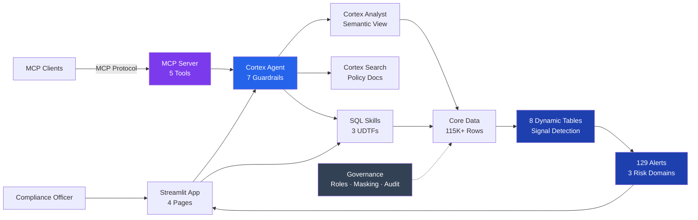

# RiskLens — FSI Risk, Fraud & Regulatory Intelligence Copilot

> A Snowflake-native compliance copilot that surfaces risk and fraud signals from banking data and produces audit-ready regulatory outputs from natural language questions — built entirely through CoCo CLI.

## Architecture



> **Detailed diagrams** — signal detection pipeline, query flow, report generation, risk domains, governance model, MCP topology, and CoCo build flow — are in [docs/07_architecture.md](docs/07_architecture.md).

---

## Documentation Index

| # | Document | Description |
|---|----------|-------------|
| 1 | [Project Overview](docs/01_project_overview.md) | What the project does, the problem it solves, and the core design principles |
| 2 | [Data Model](docs/02_data_model.md) | Complete data dictionary, schema diagram, FK relationships, seeded fraud patterns |
| 3 | [Demo Guide](docs/03_demo_guide.md) | Step-by-step 3-minute demo script with talking points |
| 4 | [Judging Criteria](docs/04_judging_criteria.md) | Tabular mapping of every hackathon criterion to our deliverables |
| 5 | [Snowflake Capabilities](docs/05_snowflake_capabilities.md) | Every Snowflake feature used and why |
| 6 | [Glossary](docs/06_glossary.md) | Every acronym and term defined |
| 7 | [Architecture](docs/07_architecture.md) | Detailed flow diagrams: data, signal, query, and report flows |
| 8 | [CoCo Usage Evidence](docs/coco_usage_evidence.md) | How CoCo was used in every phase: planning, development, execution, testing |

---

## Quick Start

```bash
# Run SQL scripts in order against your Snowflake account
sql/01_setup_database.sql    # Database + schemas
sql/02_create_tables.sql     # All core tables
sql/03_seed_data.sql         # Synthetic data with fraud patterns
sql/04_dynamic_tables.sql    # 8 signal detection DTs
sql/05_skills.sql            # 3 SQL table functions
sql/06_governance.sql        # Roles, masking, tags
sql/07_cortex_objects.sql    # Search, Agent, MCP, Streamlit

# Upload Streamlit app
PUT file://streamlit/streamlit_app.py @RISKLENS.CORE.STREAMLIT_STAGE OVERWRITE=TRUE AUTO_COMPRESS=FALSE;
```

---

## Repo Structure

```
├── AGENTS.md                         # CoCo project instruction file
├── README.md                         # This file (index)
├── sql/
│   ├── 01_setup_database.sql         # Database + schemas
│   ├── 02_create_tables.sql          # 9 tables + audit log
│   ├── 03_seed_data.sql              # 115K+ rows with 5 fraud patterns
│   ├── 04_dynamic_tables.sql         # 8 signal detection Dynamic Tables
│   ├── 05_skills.sql                 # 3 SQL UDTFs + regulatory lookup
│   ├── 06_governance.sql             # Roles, masking, tags, FK check
│   └── 07_cortex_objects.sql         # Search, Agent, MCP, Streamlit
├── skills/
│   └── agent_spec.yaml               # Cortex Agent specification
├── streamlit/
│   └── streamlit_app.py              # 4-page compliance dashboard
└── docs/
    ├── 01_project_overview.md        # What it does
    ├── 02_data_model.md              # Data dictionary + FK diagram
    ├── 03_demo_guide.md              # 3-minute demo script
    ├── 04_judging_criteria.md        # Rubric mapping
    ├── 05_snowflake_capabilities.md  # Snowflake features used
    ├── 06_glossary.md                # Terms and acronyms
    ├── 07_architecture.md            # Flow diagrams
    └── coco_usage_evidence.md        # CoCo usage across all phases
```

---

## Key Numbers

| Metric | Value |
|--------|-------|
| Tables | 9 (7 core + audit log + eval questions) |
| Rows | 115,510+ |
| Dynamic Tables | 8 (signal detection) |
| Signals Detected | 129 (35 Critical, 13 High, 81 Medium) |
| SQL Skills | 3 (Fraud Detection, AML Match, Basel Metrics) |
| Agent Skills | 3 (SKILL.md on stage) |
| Regulatory Docs | 20 chunks across 5 documents |
| Golden Questions | 10 (across AML, Credit, Liquidity) |
| Guardrails | 7 explicit rules in agent |
| FK Integrity | 0 orphan keys (6 relationships validated) |

---

## Demo Accounts

| Account | Pattern | Severity |
|---------|---------|----------|
| ACC-00000050 | Structuring (25 deposits under $10K) | HIGH |
| ACC-00000100 | Layering (rapid in-out CH→HK) + Watchlist | CRITICAL |
| ACC-00000200 | Dormant reactivation (14mo inactive) | MEDIUM |
| ACC-00000300 | Fan-out (35 recipients in 24h) | HIGH |
| ACC-00000400 | High-risk wires to OFAC entity | CRITICAL |

---

*Built with Snowflake Cortex · CoCo CLI · Dynamic Tables · Streamlit*
