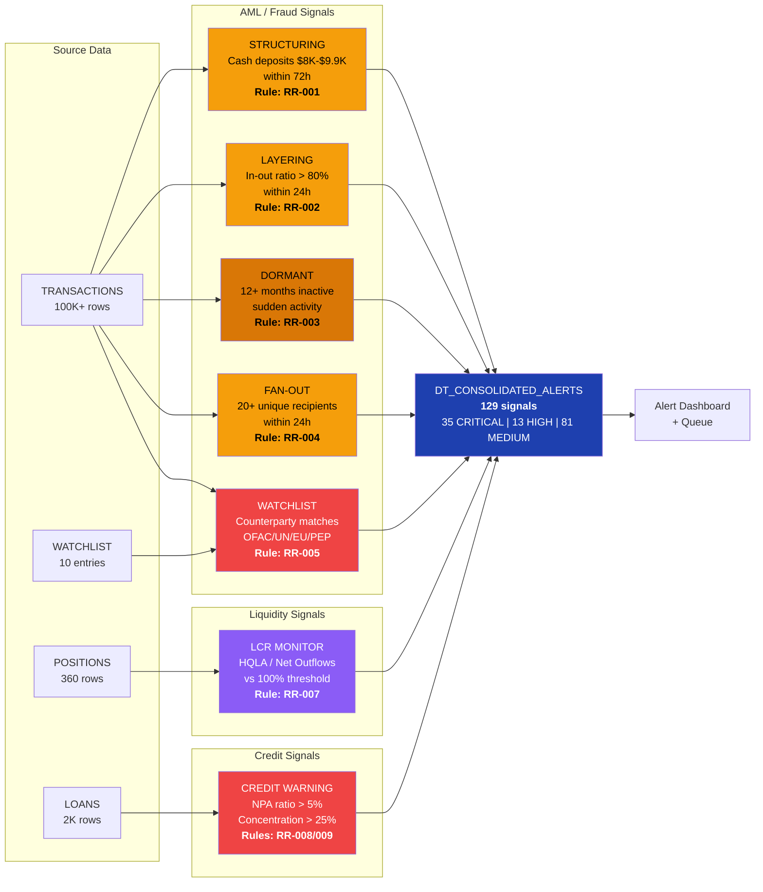
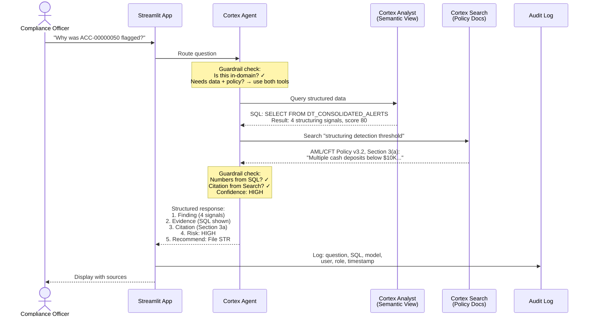
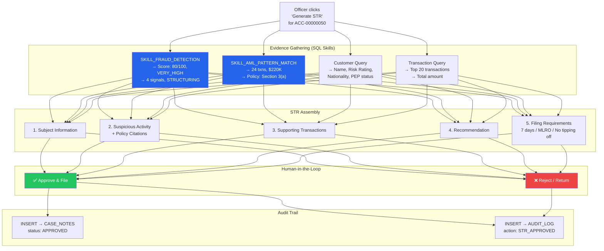
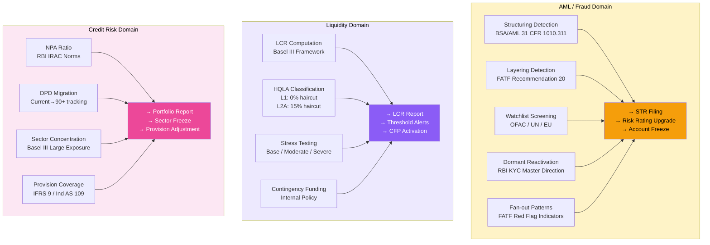
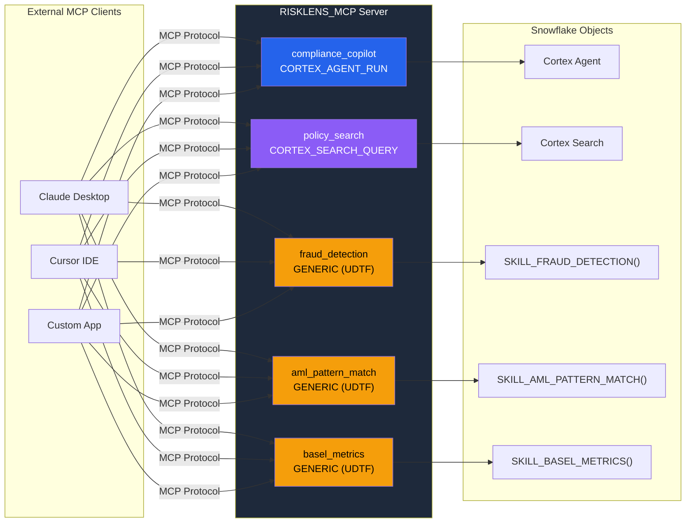

# 07 — Architecture

## 1. System Architecture (High-Level)

```mermaid
graph TB
    subgraph EXTERNAL["External Clients"]
        MCP_CLIENT["MCP Clients<br/>(Claude, Cursor, etc.)"]
        BROWSER["Compliance Officer<br/>(Browser)"]
    end

    subgraph RISKLENS_DB["RISKLENS Database"]

        subgraph DATA["Data Layer — CORE Schema"]
            CUST["CUSTOMERS<br/>5,000 rows"]
            ACC["ACCOUNTS<br/>8,000 rows"]
            TXN["TRANSACTIONS<br/>100,110 rows"]
            LOANS["LOANS<br/>2,000 rows"]
            POS["POSITIONS<br/>360 rows"]
            WL["WATCHLIST<br/>10 entries"]
            RULES["RISK_RULES<br/>10 rules"]
        end

        subgraph SIGNALS["Signal Detection — SIGNALS Schema"]
            DT_STRUCT["DT_STRUCTURING<br/>Cash &lt; $10K threshold"]
            DT_LAYER["DT_LAYERING<br/>Rapid in-out wires"]
            DT_DORM["DT_DORMANT<br/>Reactivation"]
            DT_FAN["DT_FAN_OUT<br/>1-to-many transfers"]
            DT_WL["DT_WATCHLIST_HITS<br/>Sanctions matches"]
            DT_LCR["DT_LCR_MONITOR<br/>Liquidity ratio"]
            DT_CREDIT["DT_CREDIT_WARNING<br/>NPA + concentration"]
            DT_ALL["DT_CONSOLIDATED_ALERTS<br/>129 signals unified"]
        end

        subgraph REGULATORY["Knowledge Layer — REGULATORY Schema"]
            CHUNKS["REGULATORY_CHUNKS<br/>20 chunks / 6 documents"]
            CS["Cortex Search Service<br/>POLICY_SEARCH"]
        end

        subgraph AI["AI Layer — Cortex"]
            SV["Semantic View<br/>RISKLENS_COMPLIANCE<br/>6 tables, 10 VQRs"]
            ANALYST["Cortex Analyst<br/>(Text-to-SQL)"]
            AGENT["Cortex Agent<br/>COMPLIANCE_COPILOT<br/>7 Guardrails"]
            SKILLS_STAGE["Agent Skills<br/>fraud_detection.SKILL.md<br/>basel_metrics.SKILL.md<br/>str_generator.SKILL.md"]
        end

        subgraph SKILL_FNS["SQL Skills (UDTFs)"]
            SK1["SKILL_FRAUD_DETECTION<br/>Risk score + reason codes"]
            SK2["SKILL_AML_PATTERN_MATCH<br/>Typology → policy clause"]
            SK3["SKILL_BASEL_METRICS<br/>LCR / NPA / PCR in SQL"]
        end

        subgraph MCP_SVR["MCP Server"]
            MCP["RISKLENS_MCP<br/>5 tools exposed"]
        end

        subgraph UI["Presentation Layer"]
            ST["Streamlit App<br/>RISKLENS_APP"]
            PG1["Dashboard<br/>KPIs + Charts + Alerts"]
            PG2["Investigation<br/>NL Chat"]
            PG3["Evidence & Skills<br/>Run + Inspect"]
            PG4["Report Generator<br/>STR + LCR + Credit"]
        end

        subgraph GOV["Governance & Audit"]
            ROLES["3 Roles<br/>ANALYST → CO → MLRO"]
            MASK["3 Masking Policies<br/>Name / Email / Phone"]
            TAGS["3 Tag Types<br/>Sensitivity / Domain / PII"]
            AUDIT["COPILOT_AUDIT_LOG<br/>Every interaction"]
            CASE["CASE_NOTES<br/>Findings + Approvals"]
            TASK["DAILY_SIGNAL_MONITOR<br/>Scheduled 8am ET"]
        end
    end

    %% Data flows
    TXN --> DT_STRUCT & DT_LAYER & DT_DORM & DT_FAN
    TXN & WL --> DT_WL
    POS --> DT_LCR
    LOANS --> DT_CREDIT
    DT_STRUCT & DT_LAYER & DT_DORM & DT_FAN & DT_WL & DT_LCR & DT_CREDIT --> DT_ALL

    CHUNKS --> CS

    SV --> ANALYST
    ANALYST --> AGENT
    CS --> AGENT
    SKILLS_STAGE --> AGENT

    AGENT --> MCP
    MCP_CLIENT --> MCP

    SK1 & SK2 & SK3 --> ST

    AGENT --> ST
    BROWSER --> ST
    ST --> PG1 & PG2 & PG3 & PG4

    PG2 & PG3 & PG4 --> AUDIT
    PG4 --> CASE

    DT_ALL --> PG1
    TASK --> AUDIT

    MASK --> CUST
    TAGS --> CUST & TXN & LOANS & POS
    ROLES --> GOV
```

## 2. Signal Detection Flow

## 3. Query Flow (Question → Answer)

## 4. Report Flow (Evidence → STR Filing)

## 5. Three Risk Domains

## 6. Governance Model

```mermaid
graph LR
    subgraph ROLES["Role Hierarchy"]
        ANALYST["RISKLENS_ANALYST<br/>Read-only access"]
        CO["RISKLENS_COMPLIANCE_OFFICER<br/>+ Case note read"]
        MLRO["RISKLENS_MLRO<br/>+ Write + Approve + Full PII"]
        ADMIN["ACCOUNTADMIN"]

        ANALYST --> CO --> MLRO --> ADMIN
    end

    subgraph MASKING["PII Masking"]
        direction TB
        M1["ANALYST sees:<br/>J*** | S*** | ja***@email.com"]
        M2["MLRO sees:<br/>James | Smith | james.smith@email.com"]
    end

    subgraph TAGS_SEC["Object Tags"]
        T1["SENSITIVITY_LEVEL<br/>PUBLIC / INTERNAL /<br/>CONFIDENTIAL / RESTRICTED"]
        T2["DATA_DOMAIN<br/>AML / CREDIT_RISK /<br/>LIQUIDITY / KYC"]
        T3["PII<br/>TRUE / FALSE"]
    end

    subgraph AUDIT_SEC["Audit"]
        AU1["COPILOT_AUDIT_LOG<br/>Every question logged"]
        AU2["FK_INTEGRITY_CHECK<br/>0 orphan keys"]
        AU3["DAILY_SIGNAL_MONITOR<br/>Scheduled task 8am ET"]
    end

    ANALYST --> M1
    MLRO --> M2

    style ANALYST fill:#94a3b8,color:#000
    style CO fill:#60a5fa,color:#000
    style MLRO fill:#2563eb,color:#fff
    style ADMIN fill:#1e40af,color:#fff
```

## 7. MCP Server Topology

## 8. CoCo Build Flow

```mermaid
flowchart LR
    subgraph PLAN["1. Planning"]
        P1["Architecture<br/>blueprint"]
        P2["Data model<br/>design"]
        P3["AGENTS.md<br/>created"]
    end

    subgraph DEV["2. Development"]
        D1["Tables +<br/>Seed Data"]
        D2["Dynamic<br/>Tables (8)"]
        D3["Cortex Search<br/>+ Semantic View"]
        D4["SQL Skills<br/>(3 UDTFs)"]
        D5["Agent +<br/>Skills (3)"]
        D6["MCP Server"]
        D7["Streamlit<br/>App"]
        D8["Governance"]
    end

    subgraph EXEC["3. Execution"]
        E1["End-to-end<br/>demo flow"]
        E2["Scheduled<br/>monitoring"]
    end

    subgraph TEST["4. Testing"]
        T1["FK integrity<br/>0 orphans"]
        T2["Signal counts<br/>129 verified"]
        T3["Skill outputs<br/>validated"]
        T4["Golden Qs<br/>10 tested"]
    end

    P1 --> P2 --> P3 --> D1
    D1 --> D2 --> D3 --> D4 --> D5 --> D6 --> D7 --> D8
    D8 --> E1 --> E2 --> T1 --> T2 --> T3 --> T4

    style PLAN fill:#ede9fe,color:#000
    style DEV fill:#dbeafe,color:#000
    style EXEC fill:#d1fae5,color:#000
    style TEST fill:#fef3c7,color:#000
```

